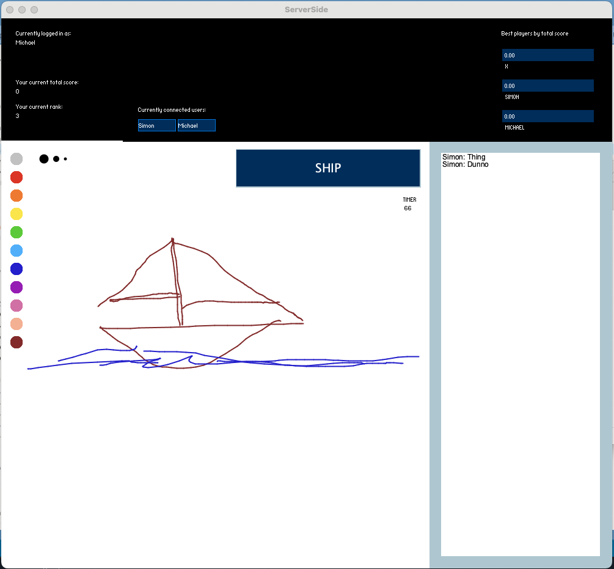
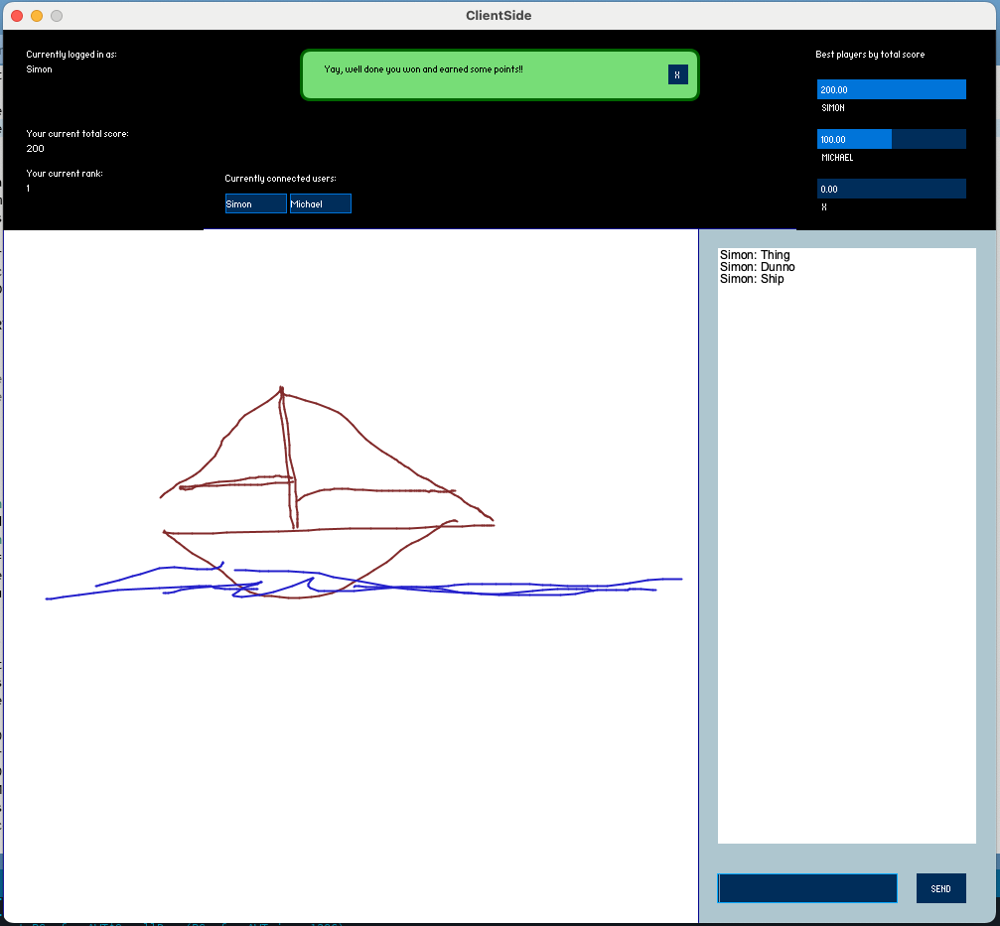
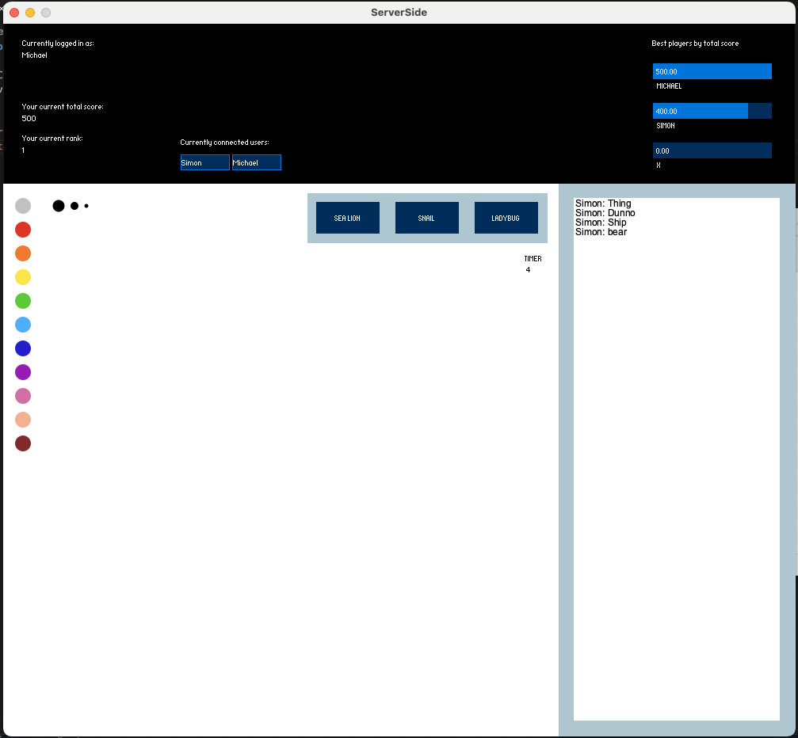

# Pictionary

Server/Client application that allows playing a pictionary game.
The server draws and handles user interaction (login, register, scores, etc.), while multiple clients can guess what is drawn.
Correct guesses end the round and points get awarded to the server as well as the guessing player.

After each round, the server can choose one of three words to draw.
